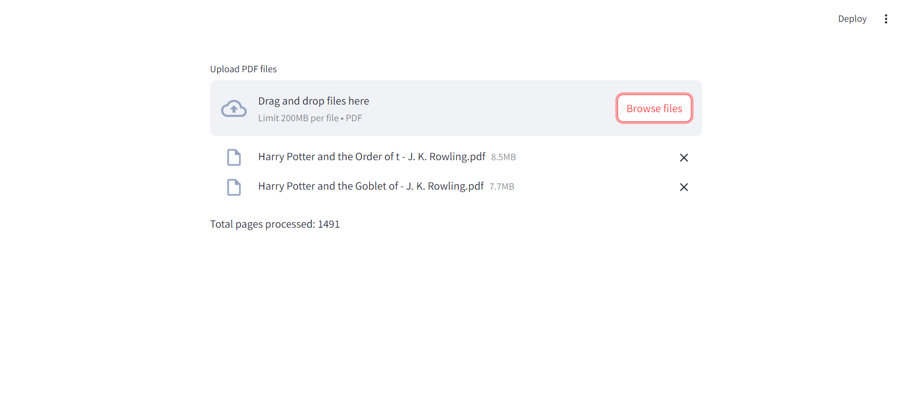
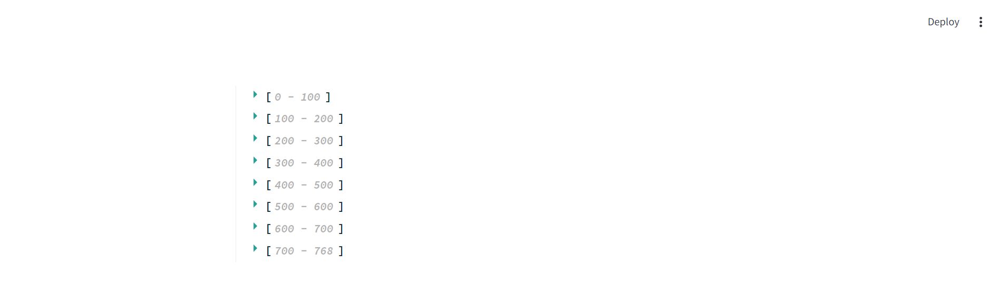
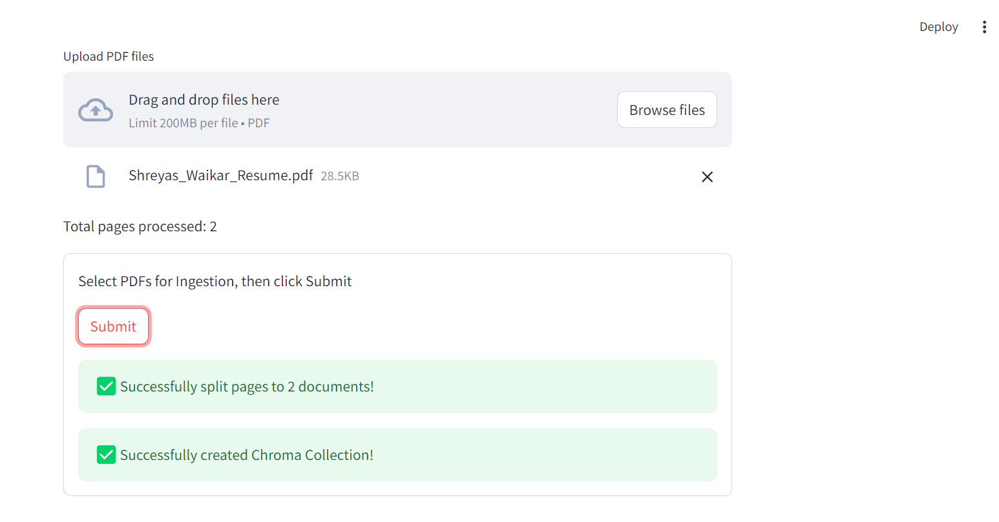
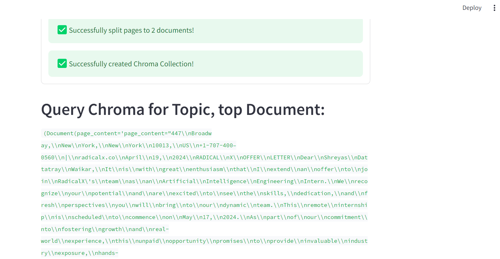
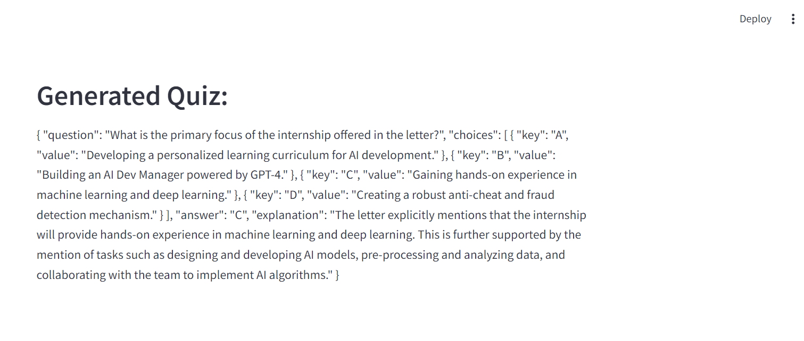
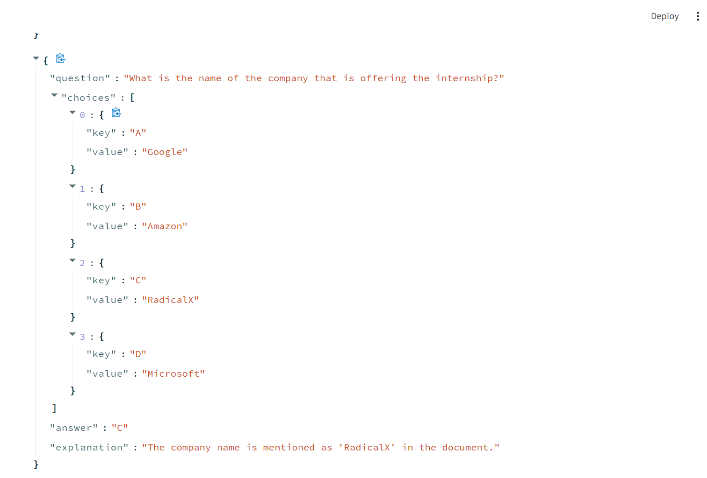
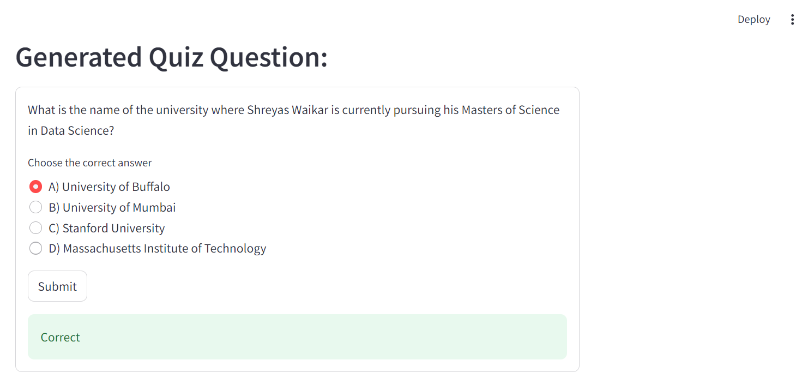
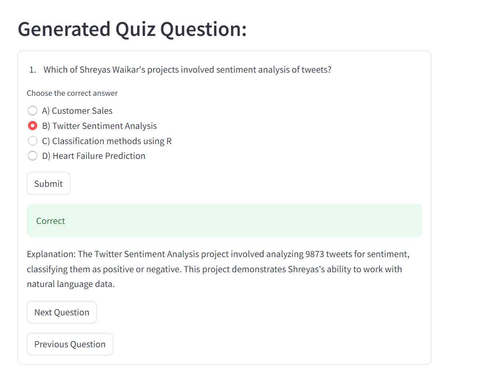

# Gemini-quizify

# Description

An AI-powered platform for generating quizzes using Google Cloud's Vertex AI. It features document ingestion via Streamlit, embedding creation with Vertex AI, and dynamic quiz generation. Users can upload PDFs, process them, and generate unique quiz questions through an interactive Streamlit interface.

# Task 1

### Steps for Google Cloud, Vertex AI, & SDK Authentication.

1. Create a Google Cloud Account

   - Provide billing information to access GCP free trial credits

2. Create a new Google Cloud Project

3. Enable recommended APIs on Vertex AI

4. Create a Service Account
   - Give the service account 'owner' permissions
   - Create a key for the service account

# Task 2

### Steps for Dev Environment Setup.

1. Using your terminal, clone or fork the mission-quizify repository: https://github.com/radicalxdev/mission-quizify

2. Add the local service account key to the repository

   - Ensure that the .gitignore explicitly excludes your key for security purposes

3. Export the key as authentication. An example command for WSL would be, export GOOGLE_APPLICATION_CREDENTIALS='service_account_key.json"
   - If you encounter errors, check the path of authentication
   - A second area of errors come from setting incorrect GCP permissions

# Task 3

### Steps for Document Ingestion

1. Render a file uploader widget. Replace 'None' with the Streamlit file uploader code.

   - Allow multiple PDF types for ingestion

2. Process the file

   - Use PyPDFLoader from Langchain to load the PDF and extract pages. A reference document can be found here: https://python.langchain.com/docs/modules/data_connection/document_loaders/pdf#using-pypdf

3. Add the extracted pages to the pages class variable

4. Test the file using streamlit run to ensure documents can be ingested and processed for PDFs

# Task 4

### Steps for Embedding with VertexAI & Langchain

1. Implement the init method to accept 'model_name', 'project', and 'location' parameters.

2. Within the init method, initialize the 'self.client' attribute as an instance of VertexAIEmbeddings.

3. Test the file using streamlit run and have a preview of Hello World as an embedding.

# Task 5

### Steps for Data Pipeline to Chroma DB

1. Check if any documents have been processed by the DocumentProcessor instance and display an error message if not.

2. Split the processed documents into text chunks suitable for embedding and indexing using the CharacterTextSplitter from Langchain.

3. Create a Chroma collection in memory with the text chunks obtained from step 2 and the embeddings model initialized in the class using the Chroma.from_documents method.

4. Test the ChromaDB using streamlit run and upload a small PDF for testing if the Chroma Collection is created.

# Task 6

### Steps for Streamlit UI for Data Ingestion

1. Begin by initializing an instance of the DocumentProcessor and invoke the ingest_documents() method to process the uploaded PDF documents.

2. Configure and initialize the EmbeddingClient with the specified model, project, and location details as provided in the embed_config.

3. Instantiate the ChromaCollectionCreator using the previously initialized DocumentProcessor and EmbeddingClient.

4. Utilize Streamlit to construct a form. This form should prompt users to input the quiz's topic and select the desired number of questions via a slider component.

5. Following the form submission, employ the ChromaCollectionCreator to forge a Chroma collection from the documents processed earlier.

6. Enable users to input a query pertinent to the quiz topic. Utilize the generated Chroma collection to extract relevant information corresponding to the query, which aids in quiz question generation.

# Task 7

### Steps for Quiz Generator Class

1. Within the init_llm() method for QuizGenerator class, set the LLM's model name to "gemini-pro"

2. Configure the 'temperature' parameter to control the randomness of the output. A lower temperature results in more deterministic outputs.

3. Specify 'max_output_tokens' to limit the length of the generated text. It is recommended to set within a range of 300 - 500 tokens.

4. Initialize the LLM with the specified parameters to be ready for generating quiz questions.

5. Within the generate_question_with_vectorstore() method, Verify the LLM and vectorstore are initialized and available.

6. Retrieve relevant documents or context for the quiz topic from the vectorstore.

7. Format the retrieved context and the quiz topic into a structured prompt using the system template.

# Task 8

### Steps for Generate Quiz Algorithm

1. Begin with the generate_quiz() method. Initialize an empty list to store the unique quiz questions.

2. Loop through the desired number of questions (num_questions), generating each question via generate_question_with_vectorstore.

3. For each generated question, validate its uniqueness using validate_question.

4. If the question is unique, add it to the quiz; if not, continue the loop. Consider implementing a retry limit to prevent runaway LLM inferences and error loops.

5. Return the compiled list of unique quiz questions.

6. Within the validate_question() method, Extract the question text from the provided dictionary.

7. Iterate over the existing questions in question_bank and compare their texts to the current question's text.

8. If a duplicate is found, return False to indicate the question is not unique. If no duplicates are found, return True, indicating the question is unique and can be added to the quiz.

# Task 9

### Steps for Generate Quiz UI

1. Within the QuizManager class, Store the provided list of quiz question objects in an instance variable named questions.

2. Calculate and store the total number of questions in the list in an instance variable named total_questions.

3. Within the next_question_index() method, Retrieve the current question index from Streamlit's session state.

4. Adjust the index based on the provided direction (1 for next, -1 for previous), using modulo arithmetic to wrap around the total number of questions.

5. Update the question_index in Streamlit's session state with the new, valid index.

6. Starting on Line 113 under the line, Generated Quiz Question: , Use the get_question_at_index method to set the 0th index for a variable, index_question

7. Unpack the choices from the question onto a radio Substep A: Set the key from the index question Substep B: Set the value from the index question

8. Display the question onto streamlit using st.write()

9. Use streamlit run to test the application. Upload a small PDF for ingestion and preview the generated question.

# Task 10

### Steps for Screen State Handling

1. Initialize the question bank list in st.session_state on line 24.

2. Set the topic input and number of questions using Streamlit's widgets for input starting on line 43.

3. Initialize a QuizGenerator class using the topic, number of questions, and the chroma collection.

4. Initialize the question bank list in st.session_state.

5. Set a display_quiz flag in st.session_state to True.

6. Set the question_index to 0 in st.session_state.

7. Set index_question using the Quiz Manager method get_question_at_index passing the st.session_state["question_index"].

8. Use the next_question_index method from our quiz_manager class in order to navigate the different questions within the quiz. Example: st.form_submit_button("Next Question, on_click=lambda: quiz_manager.next_question_index(direction=1)").

**Contributer** -
**Shreyas Waikar**

- [LinkedIn](https://www.linkedin.com/in/connect-with-shreyas-waikar/)
- [GitHub](https://github.com/sdwaikar)
